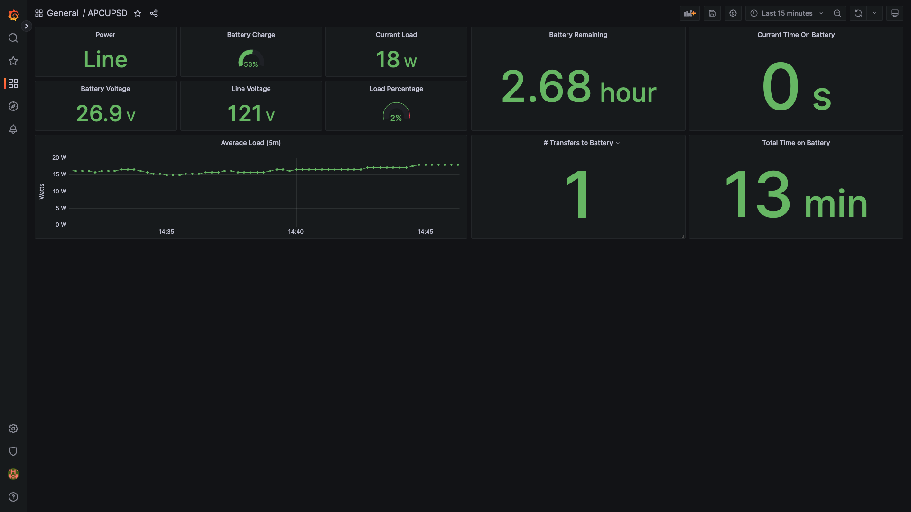

# APCUPSD Prometheus

This image allows you to export [APCUPSD](http://www.apcupsd.org/) stats to Prometheus format so they can be consumed by the [Prometheus Node Exporter](https://hub.docker.com/r/prom/node-exporter) text collector and displayed within [Grafana](https://grafana.com/).

# Installation via Docker-Compose
An easy installation method is to use a docker-compose.yaml file to run the image.

```
version: "3.7"
services:
  apcupsdPrometheus:
    image: threevl/apcupsd-prometheus
    privileged: true
    environment:
        APCUPSD_OUTPUT_FILEPATH: # Rename the output prometheus data file (defaults to apcupsd.prom)
        APCUPSD_DEBUG: # View debugging information (defaults to undefined) 
    volumes:
        - /dev/bus/usb:/dev/bus/usb # Use this to mount the USB bus of your linux server inside the container so that it can interact with your pwrstat UPS
        - /var/lib/node_exporter/textfile_collector:/root/textfile_collector # Use this to mount the volume where the prometheus data file should be exported to
        - /apcupsd.conf:/etc/apcupsd.conf # OPTIONAL: Set a custom apcupsd config file to override defaults see apcupsd.conf
```
# Grafana dashboard



You can load the above dashboard into grafana by importing the [Dashboard JSON file](./grafana.apcupsd.json).

# Available metrics
The following metrics are made available by this exporter:

```
apcupsd_line_voltage
apcupsd_load_percentage
apcupsd_battery_charge_percentage
apcupsd_time_left
apcupsd_output_voltage
apcupsd_internal_temperature
apcupsd_battery_voltage
apcupsd_line_frequency
apcupsd_number_of_transfers_to_battery
apcupsd_time_on_battery
apcupsd_total_time_on_battery
apcupsd_humidity
apcupsd_ambient_temperature
apcupsd_number_of_bad_battery_packs
apcupsd_nominal_power
```

*NOTE: The specific metrics available to you may vary depending on the model of your UPS*

Each metric above has the following labels applied to allow for filtering:

```
hostname
name
model
serial_number
apc_model
```


The following labels are made available on the apcupsd_info metric.
```
apcupsd_info.apc_header
apcupsd_info.data_read_date
apcupsd_info.hostname
apcupsd_info.name
apcupsd_info.version
apcupsd_info.cable_type
apcupsd_info.model
apcupsd_info.mode
apcupsd_info.start_time
apcupsd_info.status
apcupsd_info.battery_charge_percentage_shutdown_trigger
apcupsd_info.minimum_time_left_shutdown_trigger
apcupsd_info.maximum_time_left_shutdown_trigger
apcupsd_info.max_line_voltage
apcupsd_info.min_line_voltage
apcupsd_info.line_voltage_sensitivity_level
apcupsd_info.wake_delay
apcupsd_info.shutdown_delay
apcupsd_info.low_battery_signal_delay
apcupsd_info.low_line_voltage_battery_trigger
apcupsd_info.high_line_voltage_battery_trigger
apcupsd_info.return_power_on_battery_percentage
apcupsd_info.alarm_delay
apcupsd_info.last_transfer_reason
apcupsd_info.time_on_battery
apcupsd_info.time_off_battery
apcupsd_info.self_test_result
apcupsd_info.automatic_self_test_interval
apcupsd_info.status_flag
apcupsd_info.dip_switch_settings
apcupsd_info.fault_register_1
apcupsd_info.fault_register_2
apcupsd_info.fault_register_3
apcupsd_info.date_of_manufacture
apcupsd_info.serial_number
apcupsd_info.last_battery_replacement_date
apcupsd_info.nominal_output_voltage
apcupsd_info.nominal_input_voltage
apcupsd_info.nominal_battery_voltage
apcupsd_info.nominal_power
apcupsd_info.number_of_user_defined_external_battery_packs
apcupsd_info.firmware_revision
apcupsd_info.apc_model
apcupsd_info.status_record_write_date
```